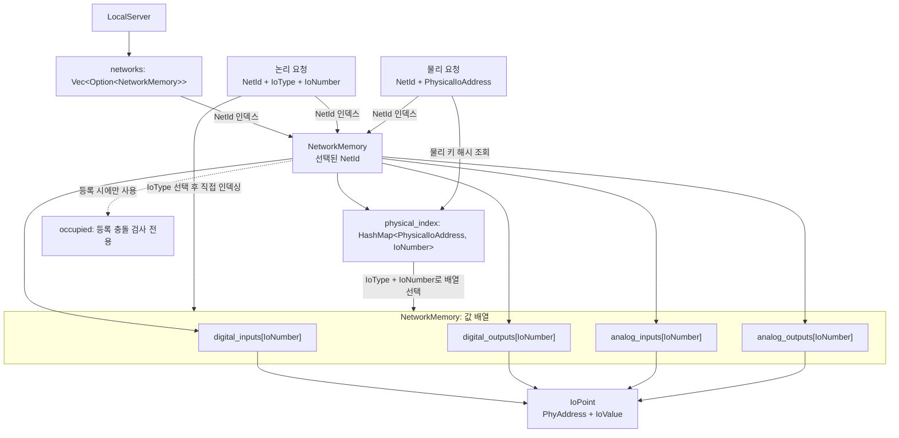

# 가상 디바이스 메모리 구조

현재 구현은 실제 하드웨어 바이트 이미지를 복제하지 않고 DI/DO/AI/AO 값을 각각의 배열에 직접 저장합니다.
외부 주소 정보는 조회와 등록 검증에 사용하며, 논리 번호와 물리 주소 접근이 동일한 값을 참조합니다.

## 저장 및 조회

```text
LocalServer
└─ networks: Vec<Option<NetworkMemory>>  // index = NetId
   ├─ digital_inputs: Vec<Option<IoPoint>>
   ├─ digital_outputs: Vec<Option<IoPoint>>
   ├─ analog_inputs: Vec<Option<IoPoint>>
   ├─ analog_outputs: Vec<Option<IoPoint>>
   ├─ physical_index: HashMap<PhysicalIoAddress, IoNumber>
   └─ occupied: 등록 시에만 사용하는 물리 범위 충돌 인덱스

IoPoint = PhyAddress(등록 정보) + IoValue(실제 값)
```



논리 요청은 IO 번호로 배열에 직접 접근합니다. 물리 요청은 `physical_index`에서 배열 위치를
먼저 찾은 뒤 같은 값에 접근합니다. 두 경로 모두 같은 `IoPoint`를 읽고 씁니다.

- DI, DO, AI, AO는 각자 별도의 배열에 값을 저장합니다.
- 번호 공간은 Digital과 Analog로 나뉩니다. 같은 NetId에서 DI/DO끼리, AI/AO끼리 번호가 중복될 수 없습니다. Digital과 Analog 사이에서는 같은 번호를 쓸 수 있습니다.
- 번호는 `u16`이며 각 배열은 등록된 최대 번호까지 확장됩니다. 빈 번호는 `None`입니다.
- 논리 접근은 `NetId → 해당 방향 배열[IONumber]`로 바로 값을 읽고 씁니다.
- 물리 접근은 `NetId → physical_index → 해당 방향 배열[IONumber]`를 사용합니다.
- `PhysicalIoAddress`에는 논리 IO 번호가 없습니다. 모듈 주소, 바이트 오프셋, 비트 위치, 크기 및 방향을 담습니다.
- Input/Output은 항목 속성입니다. 외부 입력 이미지와 출력 이미지는 같은 오프셋을 쓸 수 있으므로 물리 키와 충돌 검증에 방향을 포함합니다.
- 배열과 매핑은 비공개입니다. 외부 수정으로 조회 인덱스와 값이 어긋나는 것을 방지합니다.

## 주소 생성

TwinCAT처럼 위치를 이미 아는 경우 명시적 생성 함수를 사용합니다. IO 번호가 오프셋을 결정하지 않습니다.

```rust
use virtualdevice::{IoType, PhyAddress, ValueKind};

let digital = PhyAddress::digital(1, 10, 500, IoType::DigitalOutput, 12, Some(9));
let analog = PhyAddress::analog(1, 20, 500, IoType::AnalogInput, 48, ValueKind::I32);
```

Digital의 `Some(bit)`는 16비트 워드 내 비트 위치(0~15), `None`은 1바이트 Boolean 위치입니다.
Analog는 자료형에서 크기를 결정하지만 시작 오프셋은 전달된 값을 사용합니다.

Comizoa의 보편적인 단일 물리 배치 규칙은 가정하지 않습니다. `from_comizoa`는 모듈/API 설정인 `ComizoaLayout`과 논리 번호와 별개의 ChannelNumber를 받아 주소를 계산합니다. 현재 layout 정책은 Digital을 16채널당 2바이트로 놓고 Analog를 Digital 영역 뒤에 배치합니다. 해당 대상 장치의 매핑 사양이 이 순서를 확인할 때 사용해야 합니다. 설정을 통해 주소를 결정하므로 등록 순서는 결과에 영향을 주지 않습니다. 입출력 방향별 채널 구성이 다르면 각 방향에 해당하는 layout을 사용합니다.

## 등록과 오류

`register` 및 `register_all`은 `Result<(), MemoryError>`를 반환합니다.
각 항목은 다음 검증을 마친 뒤에만 등록합니다.

1. NetId 일치, 오프셋 계산 범위, 자료형/크기/접근 모드/비트 위치 일치
2. 같은 NetId의 Digital 번호 공간(DI+DO) 또는 Analog 번호 공간(AI+AO)의 IO 번호 중복
3. 같은 모듈과 입출력 방향에서 물리 범위 충돌

같은 워드의 서로 다른 Digital 비트는 허용합니다. 같은 비트 중복, Digital 바이트 중복,
Analog 범위 중복, Digital 워드와 Analog 범위 겹침은 오류입니다.
범위 오류에는 충돌한 기존 IO 번호와 바이트 오프셋이 포함됩니다.
`register_all`은 첫 오류에서 중단하며, 앞서 성공한 항목은 유지합니다.

## 두 접근 경로

```rust
use virtualdevice::{IoType, IoValue, LocalServer, PhyAddress};

let mut server = LocalServer::new();
let address = PhyAddress::digital(1, 10, 500, IoType::DigitalOutput, 12, Some(9));
server.register(address).unwrap();

// 논리 번호로 쓰고 물리 위치로 읽기
server.write_digital(1, 500, true).unwrap();
assert_eq!(server.read_physical(1, &address.physical_key()), Some(IoValue::Bool(true)));

// 물리 위치로 쓰고 논리 번호로 읽기
server.write_physical(1, &address.physical_key(), IoValue::Bool(false)).unwrap();
assert_eq!(server.read_digital(1, 500), Some(IoValue::Bool(false)));
```

- 논리 API: `read_digital`, `write_digital`, `read_analog`, `write_analog`
- 방향까지 검사하는 논리 API: `read_io`, `write_io`
- IO 번호 없이 접근하는 물리 API: `read_physical`, `write_physical`
- 등록 descriptor를 이용하는 물리 API: `read_phy`, `write_phy`; descriptor의 IO 번호는 조회에 사용하지 않습니다.
- 미등록 조회는 `None`, 쓰기 실패는 `MemoryError`를 반환합니다. 잘못된 자료형/방향으로 쓰면 기존 값은 유지합니다.
- 에뮬레이터에서 입력을 갱신해야 하므로 Input 항목도 쓸 수 있습니다. 외부 클라이언트 권한은 이후 어댑터 계층에서 검사합니다.

물리 읽기/쓰기는 등록된 개별 IO 값을 반환하거나 변경합니다. 워드 전체의 비트 묶음이나 원시 바이트 버퍼 접근은 제공하지 않습니다.
MotorEmulator도 LocalServer의 값을 읽습니다. 별도의 레거시 값 저장소는 사용하지 않습니다.

## API 변경 사항

기존 `PhyAddress::from`/`from_analog` 자동 오프셋 생성은 명시적 `digital`/`analog` 생성으로 교체했습니다.
`ImageRef`, `ModuleMemory`, `LegacyDeviceMemory` 및 공개 맵 필드는 제거했습니다.
메타데이터는 `NetworkMemory::addresses()`, `digital_input_count()`, `digital_output_count()`, `analog_input_count()`, `analog_output_count()`, `LocalServer::networks()`로 조회합니다. `digital_count()`와 `analog_count()`는 각각 입력과 출력의 합계입니다.

## 검증과 측정

```sh
cargo test --release -- --nocapture --test-threads=1
```

기능 테스트는 두 접근 경로의 값 공유, 중복/범위 오류, 등록 순서, 모든 정수형, 희소 번호,
NetId 분리와 값 보존을 검사합니다. 벤치마크는 1,000개 주소 생성/읽기/덮어쓰기와
50,000개 고유 주소를 AI/AO/DI/DO별 12,500개씩 나눠 IONumber 기반과 물리 주소 기반으로 측정합니다.
각 경로·종류 조합마다 1초 동안 읽기와 쓰기를 함께 반복하고 두 처리량을 따로 출력하므로 총 측정 시간은 약 8초입니다.
각 측정은 주소 전체 순회 단위로 시간을 확인하므로 1초를 약간 초과할 수 있으며 실제 경과 시간으로 처리량을 계산합니다.

## 성능 개선 과제: 물리 주소 조회

두 접근 경로는 내부 값을 찾는 단계가 다릅니다.

```text
IONumber 경로:
NetId 배열 인덱스 → IO 종류 선택 → 해당 IO 번호 배열 인덱스 → 값

물리 주소 경로:
NetId 배열 인덱스 → PhysicalIoAddress 해시 계산/조회
                  → IoNumber 획득 → IO 종류 배열 인덱스 → 값
```

IONumber 경로는 이미 알고 있는 `NetId`, `IoType`, `IoNumber`로 배열 항목을 직접 찾습니다.
물리 주소 경로는 실제 요청에 논리 번호가 없으므로 `physical_index: HashMap<PhysicalIoAddress, IoNumber>`에서 먼저 위치를 해석해야 합니다.
이 과정에서 모듈 주소, 오프셋, 비트 위치, 크기, IO 종류로 구성된 키를 해시하고 해시 테이블을 조회한 다음, 얻은 IO 번호로 값 배열을 한 번 더 조회합니다.
따라서 해시 계산과 테이블 탐색, 추가 간접 접근 및 캐시 미스 가능성이 더해져 물리 경로가 느립니다.
`PhyAddress`를 함수 인자로 전달해도 물리 조회에 사용하는 필드가 같고 `IoNumber`를 무시한다면 이 조회 단계는 줄어들지 않습니다.

공유된 50,000개 주소 벤치마크 결과는 다음과 같습니다.

| 작업 | IONumber 경로 | 물리 주소 경로 | 물리 경로 처리량 |
|---|---:|---:|---:|
| 읽기 | 435,910,496 ops/sec | 20,568,432 ops/sec | 약 4.72% (약 21.2배 낮음) |
| 쓰기 | 361,118,222 ops/sec | 25,476,978 ops/sec | 약 7.06% (약 14.2배 낮음) |

이 수치는 특정 실행에서 측정한 값이며 하드웨어와 부하에 따라 달라집니다. 향후 개선 시에는 물리 모듈/오프셋이 제한된 촘촘한 범위인지 확인해 배열 인덱싱 가능성을 검토하고, 현재 해시맵 경로와 동일한 데이터로 다시 벤치마크합니다. 주소 범위가 희소하거나 상한이 크면 배열이 메모리를 과도하게 사용할 수 있으므로, 그 경우에는 해시맵 유지와 해셔 변경을 비교합니다.
